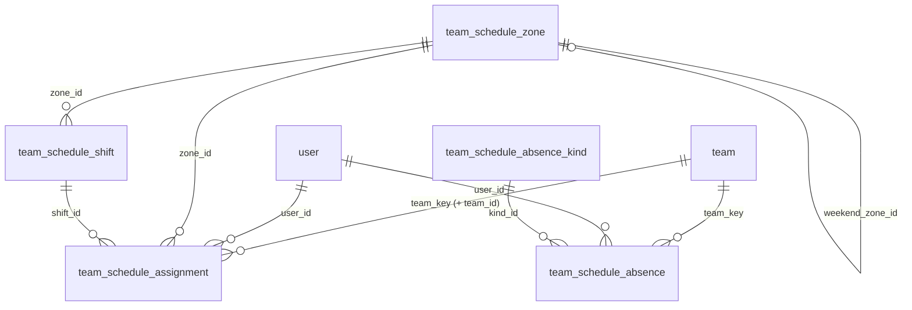

# Team Schedule — data model and deployment

The CRE and SRE rota behind the CSM portal's Team Schedule: who is working,
when, in which escalation tier, and who is away. Portal-native data with no
ServiceNow equivalent, so these tables are the system of record, not a mirror.

**Status:** code merged (#2032). Schema ships as migrations **0141–0144**.
Nothing else needs configuring: the routes are registered whenever
entity-service has a database.

## 1. The model at a glance



Three layers, one prefix. Every table is `team_schedule_*`. That keeps them
apart from `schedule`, `user_schedule` and `schedule_span` (0050), which mirror
ServiceNow's `cmn_schedule` tables and are unrelated to this.

| Layer | Table | One row is | Written by |
|---|---|---|---|
| Catalogue | `team_schedule_zone` | an SRE time zone (TZ1–TZ3) | migration 0143 |
| | `team_schedule_shift` | a named window of the day, e.g. "Evening 6-9pm", "TZ2 escalation" | migration 0143 |
| | `team_schedule_absence_kind` | a kind of time away, e.g. annual leave, customer allocation | migration 0143 |
| Facts | `team_schedule_assignment` | one engineer, one rota day, one window | leads, via the portal; importers |
| | `team_schedule_absence` | a span of days an engineer is away | leads, via the portal; importers |
| History | `team_schedule_assignment_activity`, `team_schedule_absence_activity` | one change a lead made, as the portal's "Recent changes" shows it | entity-service |
| | `team_schedule_audit` | one row-level change to any state table, from triggers | Postgres |

Plus one column on a shared table: **`team.key`** (0141). This is the only change outside the prefix.

### Time: authored in one clock, read in any

A shift stores `start_minute`/`end_minute`, counted from midnight in its
`authoring_time_zone` (`Asia/Colombo`). An end past 1440 runs into the next
day, so 21:00–06:00 is one row, `1260 → 1800`. An assignment stores the
**resolved instants** `starts_at`/`ends_at`, computed when it is written. So
"who is on duty at 03:14 UTC" is one indexed range query, and it stays
correct across DST.

`rota_date` is the day the **crew** is rostered for. A Monday 21:00–06:00
block is Monday's, even though six of its hours fall on Tuesday.

### The rules the database enforces

| Rule | How |
|---|---|
| Nobody is in two places at once | `team_schedule_assignment_no_overlap`: GiST exclusion on `(user_id, [starts_at, ends_at))`. Half-open, so 18:00 end and 18:00 start is a handover. |
| Nobody is away twice for two reasons | `team_schedule_absence_no_overlap`: exclusion on `(user_id, [starts_on, ends_on])`, closed at both ends |
| Same person, day and window only once | `team_schedule_assignment_unique_slot (user_id, rota_date, shift_id)` |
| An assignment cannot contradict its window | trigger `team_schedule_assignment_matches_shift`: where the shift fixes a zone or tier, the assignment must match it |
| A window carries at most one midnight | `end_minute <= start_minute + 1440` |
| Only SRE windows have a zone; escalation windows must | two CHECKs on `team_schedule_shift` |
| An assignment's `team_id` and `team_key` agree | composite FK to `team (id, key)` |
| A kind in use cannot be deleted | `kind_id … ON DELETE RESTRICT`. Retire a kind with `is_active = FALSE`. |

## 2. The catalogue (0143)

**SRE day**, as the leads run it:

| Zone | L1 and L2 | Regular hours | Weekend crew |
|---|---|---|---|
| TZ1 | 06:00–13:30 | 06:00–15:00 | weekend TZ1, 06:00–18:00 |
| TZ2 | 13:30–21:00 | 12:00–21:00 | weekend TZ1 |
| TZ3 | 21:00–06:00 | 21:00–06:00 | weekend TZ2, 18:00–06:00 |

**CRE windows:** 6–9am (and its on-call), regular hours LK and IND, 6–9pm,
Americas cover, weekend rotation 06:00–21:00, and Americas weekend (and its
on-call).

**Kinds of time away**, grouped by bucket:

| Bucket | Kinds |
|---|---|
| `LEAVE` | Annual (AL), Lieu (LL), Maternity (ML), Paternity (PL), Sick (SL) |
| `ALLOCATION` | RnD, Customer on site, Customer off site, Brazil rotation, Migration, Onboarding |
| `EXCLUDED` | Excluded from rota |

An allocation is a kind plus **`allocated_to`**, which says who the time is for
(the customer, or the product team for RnD). A new customer is a value, not a new
kind. Four retired kinds stay in the table as `is_active = FALSE`, so that older
absences stay readable.

Re-running 0143 never overwrites a row a lead has since edited
(`ON CONFLICT DO NOTHING`).

### What a lead can do from the roster

A lead edits their own team's rows in the Month roster's cell picker:

- **Mark leave or an allocation over a span.** They choose a start and end
  date (both editable; the start defaults to the clicked day), then a kind.
  For an allocation there is an optional **For** field, which is stored as
  `allocated_to`. It is never stored with leave. The write is
  `POST /team-schedule/absences/apply`.
- **Remove a whole span in one click.** Clicking any day of a leave or
  allocation shows the whole span with a **Remove** button, which deletes
  every day of it, including a span with no end date. The write is
  `DELETE /team-schedule/absences/{id}`. Clearing just a few days out of a
  span is still done with the date range and **Clear**.
- **Add a tag.** "+ New tag" adds a leave or allocation kind to the shared
  catalogue: a short code, a name, and a colour from the chip colours the rota
  already draws. The code is derived from the name. A name that is already
  used, or a short code another active kind already uses, is refused. Only
  team leads may add a tag, and every team sees it once added. The write is
  `POST /team-schedule/absence-kinds`. There is no delete; retire a kind with
  `is_active = FALSE`.

All three are gated on the caller leading the team (for a removal, the team
recorded on the absence row), and each is recorded in the absence history
and the audit table.

## 3. `team.key` — the one shared-table change (0141)

The rota lists every `team` whose `type` starts with `CRE` or `SRE`. It refers
to each of them by `team.key`, a lower-case handle: `apollo`, `castor`, and so on.

`team` is written by the ServiceNow sync, which knows nothing about `key`. So
0141 adds a **`BEFORE INSERT` trigger that fills `key` from the name** when a
writer leaves it out. Without that trigger the `NOT NULL` would reject every
sync insert that omits the column. That includes an `INSERT … ON CONFLICT DO
UPDATE` of a team that already exists, because Postgres checks the proposed row
before it resolves the conflict (tested). Once a row has a key, the key is never
rewritten, so renaming a team in ServiceNow does not move its rota history.

## 4. Deploying to a server

### Prerequisites

- **PostgreSQL 12 or later** (the schema uses a generated column).
- **`btree_gist` available.** 0142 runs `CREATE EXTENSION IF NOT EXISTS btree_gist`.
  It ships with Postgres, but a managed server may need it allow-listed first
  (Azure Database for PostgreSQL: add it to the `azure.extensions` server
  parameter). The migrating role needs permission to create extensions.
- **Team names unique ignoring case.** If they are not, 0141 stops before
  changing anything and names the clashing teams.
  ```sql
  SELECT lower(name), count(*) FROM team GROUP BY 1 HAVING count(*) > 1;   -- expect no rows
  ```

### Apply

The files are forward-only and safe to re-run. Apply them in order with
`make migrate` from `entity-service/`, which applies and records every file not
yet in `csm_migration_applied_migration`:

```bash
make migrate
```

Or apply them by hand, with plain autocommit (never `psql -1`), and record each
one so a later `make migrate` skips it:

```bash
psql "$DATABASE_URL" -c "CREATE TABLE IF NOT EXISTS csm_migration_applied_migration (filename TEXT PRIMARY KEY, applied_at TIMESTAMPTZ NOT NULL DEFAULT now())"
for f in 0141_team_add_key.sql 0142_team_schedule_tables.sql \
         0143_team_schedule_catalogue.sql 0144_team_schedule_audit.sql; do
  psql "$DATABASE_URL" -v ON_ERROR_STOP=1 -f "migrations/$f" &&
  psql "$DATABASE_URL" -c "INSERT INTO csm_migration_applied_migration (filename) VALUES ('$f') ON CONFLICT DO NOTHING"
done
```

| File | Creates / changes | Touches shared tables |
|---|---|---|
| `0141_team_add_key.sql` | `team.key` + fill trigger + two unique constraints | **yes**: `team` |
| `0142_team_schedule_tables.sql` | `btree_gist`, 5 enums, 7 tables, indexes, constraints, the matches-shift trigger | reads `team`, `"user"` (FKs only) |
| `0143_team_schedule_catalogue.sql` | 3 zones, 19 windows, 16 kinds | no |
| `0144_team_schedule_audit.sql` | `team_schedule_audit`, its trigger on 5 tables, one BASELINE row per existing row | no |

### A server that ran the old file names

Before this schema was renumbered it shipped as `000088`–`000104`, in the old
`.up.sql`/`.down.sql` format. `make migrate` picks up both halves of those
files, and they sort ahead of `0001`. On a server that ran it in that window,
the first two old files applied and the third failed, leaving
`schedule_zone`/`_shift`/`_assignment`/`_absence` under their pre-rename names.
0142 detects that state and drops those four tables, which can only hold
catalogue rows, before building the real ones. If any assignment or absence rows
exist, it refuses and changes nothing. The four old filenames left in
`csm_migration_applied_migration` are harmless.

### Check it worked

```sql
-- 19 windows, 16 kinds (12 active), 3 zones
SELECT (SELECT count(*) FROM team_schedule_shift)                         AS shifts,
       (SELECT count(*) FROM team_schedule_absence_kind WHERE is_active)  AS active_kinds,
       (SELECT count(*) FROM team_schedule_zone)                          AS zones;

-- The teams the rota will show. Empty means nobody will see a rota:
-- the ABT teams need a type beginning CRE or SRE (e.g. CRE-ABT, SRE-ABT).
SELECT key, name, type FROM team
 WHERE lower(type) LIKE ANY (ARRAY['cre%', 'sre%']) ORDER BY type, name;
```

Then open Team Schedule in the portal. The day view renders its bands from
the catalogue whether or not anyone is rostered yet.

### Rollback

There is no down migration. To remove the feature's schema entirely (this
destroys every rota row):

```sql
DROP TABLE IF EXISTS team_schedule_audit, team_schedule_assignment_activity,
  team_schedule_absence_activity, team_schedule_assignment, team_schedule_absence,
  team_schedule_shift, team_schedule_absence_kind, team_schedule_zone CASCADE;
DROP TYPE IF EXISTS team_schedule_shift_family_enum, team_schedule_tier_enum,
  team_schedule_day_scope_enum, team_schedule_source_enum, team_schedule_absence_bucket_enum;
DROP FUNCTION IF EXISTS team_schedule_assignment_matches_shift(), team_schedule_audit_row();
-- team.key is shared; leave it unless nothing else has started using it.
```

## 5. Known gaps

- **0141's number was not checked against `operations/csm-sync-service`**,
  which owns `team`. Confirm that 0141 is free there before production.
- **The sync must never need to change `team.key`.** It cannot today, because
  it does not know the column exists. If it ever writes `key`, that value wins
  over the trigger.
- **`team_schedule_audit.changed_at`** breaks the `_on` suffix convention.
  entity-service reads the column by that name, so renaming it is a code
  change as well as a migration.

## Change log

- **0141–0144** replace `000088`–`000107`, which were written in the old
  up/down format. They reproduce the schema and catalogue that chain ended in
  exactly (compared with `pg_dump` against a server built from the old chain).
  They also add the `team.key` fill trigger. The old files are gone; nothing
  should apply them.
